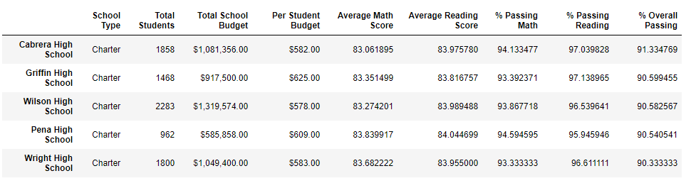
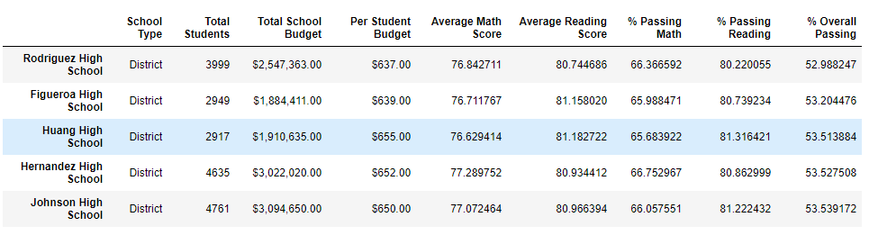
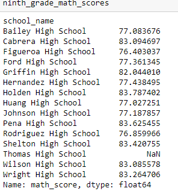
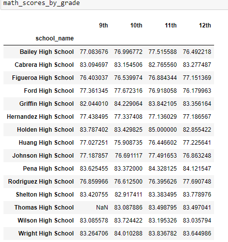
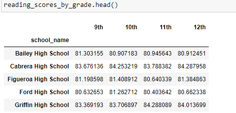
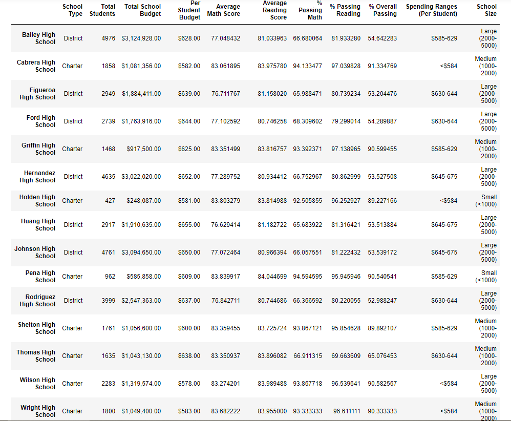

# School_District_Analysis
## Background

A school board has asked that an analysis on their records of standardized math and reading test scores, as there has been evidence of academic dishonesty. One school in particular has suspected altered data and it has been asked that the ninth grade data be omitted from the results. 

To be able to go through the large amounts of data, the Pandas library in conjunction with Jupyter Notebook was used to replace the 9th grade data for Thomas High School with NaNs to assess the impact on the results.

## Results
- Top 5 and bottom 5 performing schools, based on the overall passing rate:
Top 5:
</img>
Bottom 5:
</img>
- The average math score received by students in each grade level at each school:
### Grade 9
</img>
### By Grade:
</img>
- The average reading score received by students in each grade level at each school
</img>

- School performance based on the budget per student
- School performance based on the school size 
- School performance based on the type of school
</img>		

## Summary
There were four major changes to the school district analysis after reading and math scores have been replaced:
-   When removing the 9th grade stats, the percentage change in Thomas High School, for Passing Math, Reading, and Overall increased:
    - Math went from 83.6% to 93.2%
    - Reading went from 83.9% to 97.0%
    - Overall Passing percentage went from 83.8% to 90.6%
